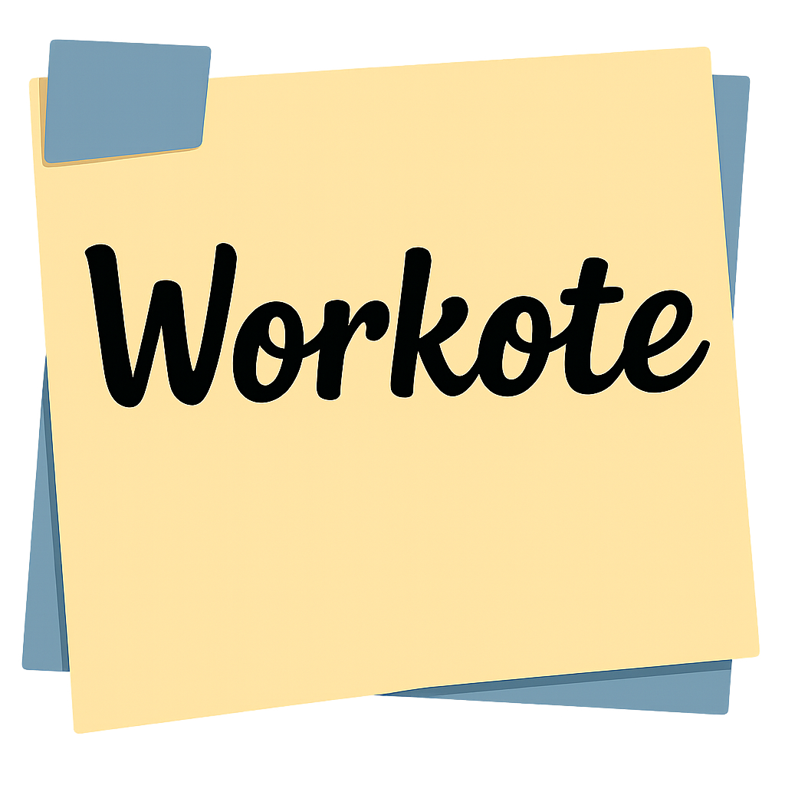

# 👋 Hi, I'm Heljarmyrkr

Welcome to my GitHub profile! 👨‍💻 I'm passionate about technology and software development. Currently, I'm working on **Pyst-it** 🚀

## 🔥 Featured Project: **Pyst-it**
**Pyst-it** is a fun, customizable version of the classic **Post-it**, with support for multiple notes, random colors, and more! 🗒️

  

✨ **Features**:
- 📌 Multiple notes in different colors
- 💾 Auto-save
- 🌈 Random and customizable colors
- 📝 Support for `.txt` and `.json` formats

💡 **What's coming next**:
- ✍️ Customizable fonts
- ✏️ Drawing mode
- 🔔 Reminders and notifications

---

## 🛠️ Tools & Technologies Used
- **Python** 🐍

<h2 align="left">I code with</h2>

###

  
  
  
  
  
  

###

---

## 📧 Contact Me
- 📧 **Email**: [kauarodr2005@gmail.com](mailto:kauarodr2005@gmail.com)
- 🤝 **Contribute**: Fork the repository, make changes, and submit a pull request!

---

🌟 **Thanks for visiting my profile!** 🌟
